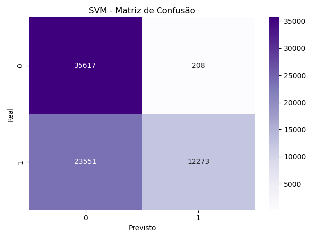
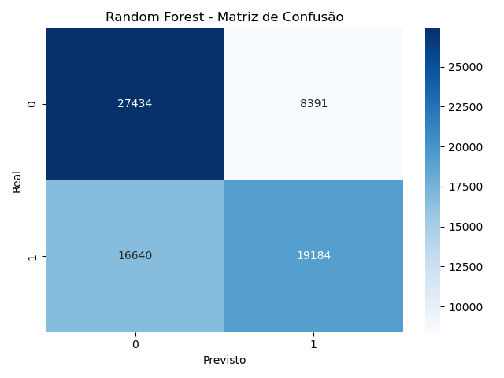
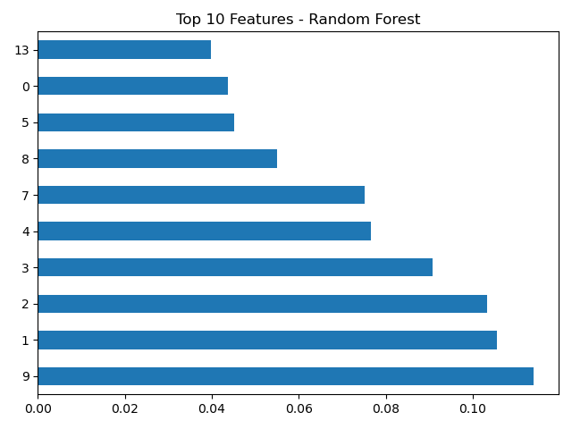

# 🛰️ WebRTC Traffic Detection

[](https://www.python.org/)
[](LICENSE)
[](#)

> **Detecção de tráfego WebRTC em ambientes criptografados utilizando reconhecimento de padrões.**  
> Projeto desenvolvido por **Leonardo Rodrigues Pereira** como parte da disciplina **Reconhecimento de Padrões** do **Programa de Mestrado em Telecomunicações e Inteligência Artificial – UTFPR**.

---

## 🧠 Objetivo

Investigar a possibilidade de **identificar fluxos WebRTC** em ambientes **totalmente criptografados** (DTLS/SRTP) a partir de **características estatísticas e temporais** dos pacotes, sem inspecionar o payload.

O estudo emprega algoritmos clássicos de *machine learning* (Random Forest, SVM) e métodos não supervisionados (K-Means, Isolation Forest), avaliando sua capacidade de distinguir tráfego **VPN / non-VPN / WebRTC** com base apenas em *flow features*.

---

## 🗂️ Estrutura do Projeto

webrtc-traffic-detection/
├── data/ # Dados brutos e processados
│ ├── raw/ # Arquivos .arff originais (ISCX VPN-nonVPN)
│ └── processed/ # Dataset consolidado e normalizado
├── scripts/ # Scripts principais do pipeline
│ ├── convert_arff_to_csv.py
│ ├── preprocess_dataset.py
│ ├── train_models.py
│ └── feature_extraction_webrtc.py
├── notebooks/ # Notebooks exploratórios (Jupyter)
│ ├── 01_exploracao_dataset.ipynb
│ ├── 02_treinamento_modelos.ipynb
│ ├── 03_visualizacao_resultados.ipynb
│ └── 04_captura_webrtc_local.ipynb
├── reports/
│ ├── figures/ # Figuras de resultados (confusão, importância)
│ └── webrtc_traffic_detection_report.pdf
├── docs/
│ ├── 01_webrtc_detection_report.tex
│ ├── methodology_notes.md
│ ├── proposal_overleaf.tex
│ └── references.bib
├── requirements.txt
└── README.md


---

## ⚙️ Execução

### 1️⃣ Preparar ambiente

Crie um ambiente virtual e instale dependências:

```bash
python3 -m venv .venv
source .venv/bin/activate
pip install -r requirements.txt

2️⃣ Converter datasets ARFF → CSV

python3 scripts/convert_arff_to_csv.py

3️⃣ Pré-processar e normalizar dados

python3 scripts/preprocess_dataset.py

4️⃣ Treinar modelos e gerar resultados

python3 scripts/train_models.py

As figuras e métricas serão salvas em:

reports/figures/

📊 Resultados Principais

| Modelo               | Métrica    | Valor |
| -------------------- | ---------- | ----- |
| **Random Forest**    | AUC        | 0.647 |
| **SVM (RBF)**        | AUC        | 0.724 |
| **K-Means**          | Silhouette | 0.729 |
| **Isolation Forest** | Correlação | 0.021 |

📈 O SVM apresentou o melhor desempenho geral (AUC = 0.724), enquanto a Random Forest destacou as features de duração, tamanho médio e intervalo entre pacotes como as mais discriminativas.

🖼️ Figuras

<p align="center">   </p> <p align="center">  </p>

📚 Referências

Draper-Gil, G., Lashkari, A. H., Mamun, M. S. I., & Ghorbani, A. A. (2016).
Characterization of Encrypted and VPN Traffic using Time-related Features. ICISSP 2016.

Taylor, V. F., Spolaor, R., Conti, M., & Martinovic, I. (2017).
Robust Identification of Encrypted Video Streams in the Wild. ACM IMC 2017.

University of New Brunswick – Canadian Institute for Cybersecurity (CIC).
ISCX VPN-nonVPN Dataset. Disponível em: https://www.unb.ca/cic/datasets/vpn.html

📜 Licença

Distribuído sob a licença MIT. Consulte o arquivo LICENSE
 para mais detalhes.
